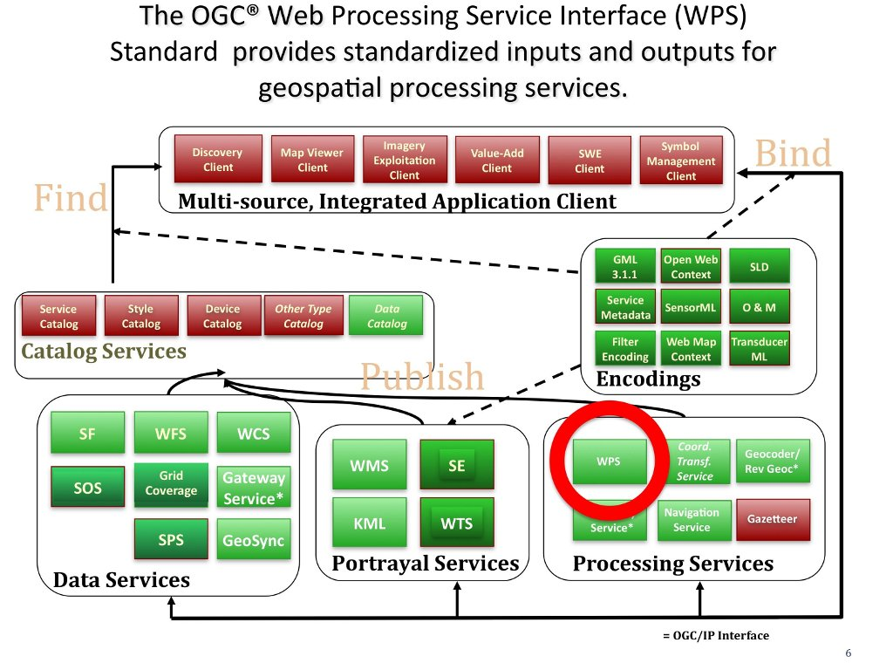

# Web Processing Service (WPS) 网络地理信息处理服务

## 0. 概述
WPS 标准为网络地理信息处理服务提供了标准化的输入和输出。当前WPS标准最新版本是2.0，其具体内容可查看 [OGC 14-065](http://docs.opengeospatial.org/is/14-065/14-065.html)。
>以下内容引用OSGeo的相关介绍：https://live.osgeo.org/zh/standards/wps_overview.html

OGC® Web Processing Service (WPS) 标准描述了如何通过远程的任何算法和模型处理获得地理空间的栅格或矢量信息产品。WPS 提供的服务可以是简单的空间定位ｉｄｅ两份数据相减，也可以是复杂大气模型等运算。(http://www.opengeospatial.org/standards/wps)。
WPS 可用于：
- 使用即插即用的机制降低数据处理流程的复杂性。
- 连接不同的处理操作。
- 开发可以被其它用户重用的处理过程。
- 处理流程和模型集中与服务提供者，方便维护。
- 利用中央服务器集群的高运算性能。
- 方便对复杂模型的公共使用。



## 1. WPS 服务
>以下内容引用 ArcGIS for Server的文档：http://server.arcgis.com/zh-cn/server/latest/publish-services/linux/wps-services.htm

### 为何使用 WPS 服务？
如果要在不同的平台和客户端之间以一种开放并经认可的方式提供地理处理服务，则 WPS 服务非常有用。任何原生支持 WPS 规范的客户端均可查看和使用您的服务。

### 范围和兼容性

客户端应用程序可通过向服务的 URL 附加参数来使用 WPS 服务。<br/>
发布到 ArcGIS Server 的 WPS 服务支持以下强制性的操作：
- 请求服务的元数据 (`GetCapabilities`)
- 请求有关可运行在服务上的进程的详细信息 (`DescribeProcess`)
- 请求运行一个由 WPS 服务实现的进程 (`Execute`)

### WPS 执行模式

WPS 服务及其随附的任务或者是**同步**，或者是**异步**。同步意味着，当任务在服务器上执行时，客户端应用程序**必须等待完成**才能执行其他任务。异步意味着，客户端应用程序**不必等待**服务器上的任务完成即可继续执行其他任务。对于这两种执行模式，任务结果都可以存储在服务器中并通过 URL 进行引用，或者直接将结果返回到客户端。

选择以同步还是异步方式执行 WPS 服务需要取决于具体情况。只有那些**执行速度快**且**仅输出小型数据集**的任务，才应被发布为**同步** WPS 服务。

### 支持 WPS 服务的数据类型
只有某些数据类型才可用作 WPS 服务的输入和输出参数。下表列出了 WPS 服务中所支持的输入和输出数据类型及其等效的子类型。

<table><thead><tr><th >输入/输出数据类型</th><th>子类型</th></tr></thead><tbody ><tr ><td rowspan="6">标准</td><td>长整型</td></tr><tr ><td>双精度</td></tr><tr ><td>字符串</td></tr><tr ><td>日期</td></tr><tr ><td>布尔型</td></tr><tr ><td>线性单位</td></tr><tr ><td>要素集</td><td>GML 3-SF</td></tr><tr ><td>记录集</td><td>GML 3-SF</td></tr><tr ><td rowspan="4">文件</td><td>.zip</td></tr><tr ><td>二进制</td></tr><tr ><td>XML</td></tr><tr ><td>纯文本</td></tr><tr ><td rowspan="2">栅格</td><td>图像/TIFF</td></tr><tr ><td>二进制（仅输入）</td></tr></tbody></table>

### 发布 WPS 服务
>与具体平台相关，参考：[教程：发布 WPS 服务](http://server.arcgis.com/zh-cn/server/latest/get-started/windows/tutorial-publishing-a-wps-service.htm)

### 使用 WPS 服务
>来源同上

#### 客户端的类型
发布 WPS 服务后，可以在任何支持 WPS 的客户端中使用它(如：[52north](https://wiki.52north.org/bin/view/Processing/52nWebProcessingService)、[uDig](http://udig.refractions.net/)、
[OpenLayers](http://openlayers.org/)、[ZOO](http://www.zoo-project.org/))。Web 浏览器是 WPS 服务最简单的客户端之一。可以通过 HTTP 请求信息，然后响应或者异常会通过浏览器返回。
#### URL 结构
>http://server.arcgis.com/zh-cn/server/latest/publish-services/windows/wps-services.htm

要使用 WPS 服务，需要了解 URL 链接地址的结构。URL 链接需要遵循下面的模式：
`http://gisserver.domain.com:6080/arcgis/services/folder/service/GPServer/WPSServer?`
例如，如果在地理处理服务 `WPSDemoService` 中启用了 WPS 功能并将其发布到服务器 `gisserver`（端口号为 6080）上名为 `DemoFolder` 的文件夹中，则 URL 将如下所示：
`http://gisserver:6080/arcgis/services/DemoFolder/WPSDemoService/GPServer/WPSServer?`
`GetCapabilities`、`DescribeProcess` 和 `Execute` 操作的 WPS 请求都可通过 HTTP 发送至此 URL。这些请求的响应和异常随后将返回到客户端。有关以上操作及其参数的详细信息，请参阅 `OGC WPS` 规范。

#### 访问WPS 服务
可按照以下步骤通过 Web 浏览器访问 WPS 服务：
1. 打开 `Web` 浏览器。
2. 执行 `GetCapabilities` 和 `DescribeProcess` 请求，如以下部分中所示。

>示例中使用的是 WPS 1.0.0 规范

##### GetCapabilities
此请求以 `GML` 格式通过服务返回所有**元数据**并处理**可用数据**。要使用 `GetCapabilities` 操作，请复制 WPS 服务 URL 并将其粘贴到地址栏中，然后在 URL 末尾添加 `?SERVICE=WPS&VERSION=1.0.0&REQUEST=GetCapabilities`。

URL 示例： `http://gisserver.domain.com:6080/arcgis/services/my_wps/GPServer/WPSServer?SERVICE=WPS&VERSION=1.0.0&REQUEST=GetCapabilities`

##### DescribeProcess

对 `DescribeProcess` 请求的响应包含提供的**特定过程详细信息**，其基本描述了过程的唯一标识符和标识符、类型以及过程的每个强制或可选输入/输出参数的方案。WPS**客户端需要此信息**来发布后续执行请求以进行实际的地理空间处理。要使用 `DescribeProcess` 操作，请复制 WPS 服务 URL 并将其粘贴到地址栏中，然后在 URL 末尾添加 `?SERVICE=WPS&VERSION=1.0.0&REQUEST=DescribeProcess`。

URL 示例： `http://gisserver.domain.com:6080/arcgis/services/my_wps/GPServer/WPSServer?SERVICE=WPS&VERSION=1.0.0&REQUEST=DescribeProcess&Identifier=output_feature_layer`

#### 执行 WPS 服务处理

要在 Web 上执行地理空间处理，可通过 WPS 客户端发送**执行请求**到 WPS 服务。执行请求通常载有 WPS 进程的每个**输入/输出参数的值或参考**，也可指定 WPS 服务应如何发回进程的结果。对执行请求的响应包含空间处理的嵌入式结果，可配置为返回最近的空间处理作业的结果。

通常可在 WPS 客户端中通过 HTTP POST 请求调用执行操作。以下是一个执行请求示例：
```xml
<wps:Execute xmlns:wps="http://www.opengis.net/wps/1.0.0" service="WPS" version="1.0.0" language="en-US">
   <ows:Identifier xmlns:ows="http://www.opengis.net/ows/1.1">SampleProcessId</ows:Identifier>
   <wps:DataInputs>
      <wps:Input>
         <ows:Identifier xmlns:ows="http://www.opengis.net/ows/1.1">Input_String</ows:Identifier>
         <wps:Data>
            <wps:LiteralData dataType="xs:string">abcdefg</wps:LiteralData>
         </wps:Data>
      </wps:Input>
   </wps:DataInputs>
   <wps:ResponseForm>
      <wps:ResponseDocument storeExecuteResponse="true" lineage="true" status="false">
         <wps:Output schema="http://www.w3.org/TR/xmlschema-2/#string" asReference="false">
            <ows:Identifier xmlns:ows="http://www.opengis.net/ows/1.1">Output_String</ows:Identifier>
         </wps:Output>
      </wps:ResponseDocument>
   </wps:ResponseForm>
</wps:Execute>
```
