# TauDEM使用-ArcGIS工具箱-01
>本文介绍基于TauDEM Toolbox在ArcGIS中进行水文地形分析的操作方法流程。由于个别词汇难以查到确切的专业翻译，可能与常用术语有出入，欢迎指正！ 
原文：
《TauDEM 5.3 QUICK START GUIDE TO USING THE TAUDEM ARCGIS TOOLBOX》

## TauDEM 简介
TauDEM (Terrain Analysis Using Digital Elevation Models，基于DEM的地形分析) 是一个基于DEM（数字高程模型）地形数据进行水文信息提取和分析的工具集。TauDEM由犹他州立大学（Utah State University，USU）为数字水文高程模型分析和流域划分而开发，可以从[官方网站](http://hydrology.usu.edu/taudem/)获得安装包.
TauDEM有命令行（command line）和ArcGIS工具箱两种操作方式，本文仅说明其在ArcGIS中的操作

## 系统需求
完成本教程需要使用** ArcGIS 10.0 +**及**TauDEM 5.3 **。若安装过TauDEM的旧版本，需要先卸载掉。TauDEM 5.3包含以下依赖（安装TauDEM时会一并安装）：
- GDAL - [Geospatial Data Abstraction Library](http://www.gdal.org/)
- 并行处理：Microsoft HPC Pack 2012 MS-MPI Redistributable Package.
- VC++运行时：Microsoft Visual C++ run time libraries for 32 and 64 bit windows platforms.

## 安装并在ArcGIS中激活TauDEM Toolbox
1. 下载安装[TauDEM 5.3](http://hydrology.usu.edu/taudem/taudem5/downloads.html)，其依赖的GDAL等会自动安装（GDAL等会安装到C盘下面）
2. ArcGIS中激活TauDEM Toolbox
 - 启动 ArcMap/ArcCatalog，打开 ArcToolbox 窗口 
 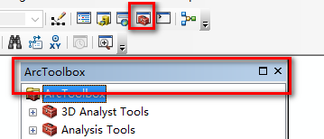
 - 在ArcToolbox 窗口右键选择【Add Toolbox】，然后找到安装目录下的【TauDEM Tools.tbx】添加，Done。 
 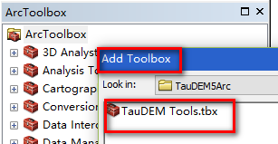

## 1. 基本格网分析 Basic Grid Analysis
#### 1.1 下载 [Cub River 实验数据]( http://hydrology.usu.edu/taudem/)，解压后加入`cubdem`到ArcMap中。
注意：实验数据存放**路径中不能出现中文**，否则后续操作中会报错：
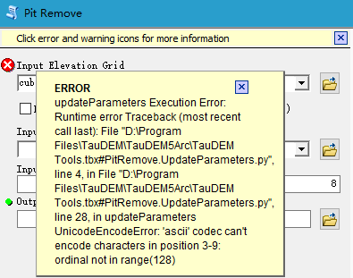

#### 1.2 填洼操作( Pit Remove )
 - 选择 pit remove 工具 
 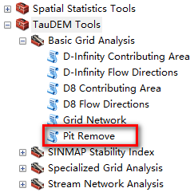
 - 选择输入(e.g. tiff, ESRI grid, img)输出数据，设置是否4邻域填充、掩膜数据（真实的不进行填充的洼地等）、处理器个数（物理内核个数2倍左右）参数（show-help可查看帮助） 
 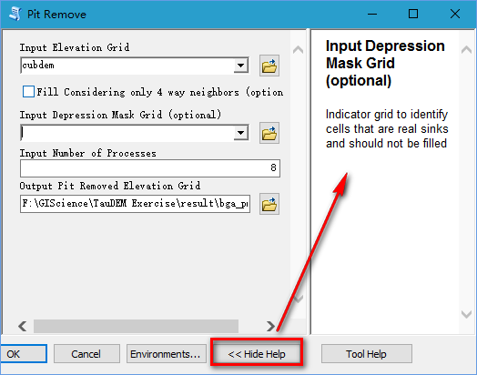
 确定之后执行填洼操作,获得以 **文件名**+`fel.tif`结尾的结果： 
 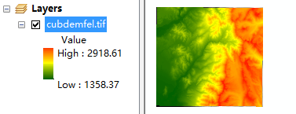

 #### 1.3 D8流向操作 D8 Flow Direction.
 此操作以填洼之后具有正确高程值的格网数据（`cubdenfel.tif`）为输入，输出基于D8算法的格网单元水流流向数据(`p`结尾：`cubdemp.tif`，以数字1-8来表示每个格网单元的最陡坡降方向（8邻域下的水流流向）)和每个格网的坡度(`sd8`结尾：`cubdemsd8.tif`)。 
 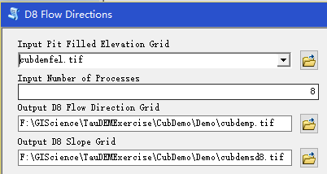

 #### 1.4 D8 集水区（集水面积，Contributing Area）.
 基于D8 流向数据计算流向各个格网的水流流过的格网数。每个格网的集水面积是其本身加上水流在其上坡方向流过的格网单元数（水流累积格网）。如果每个格网有权重，则是加权和。此操作结果数据以`ad8`结尾。 
 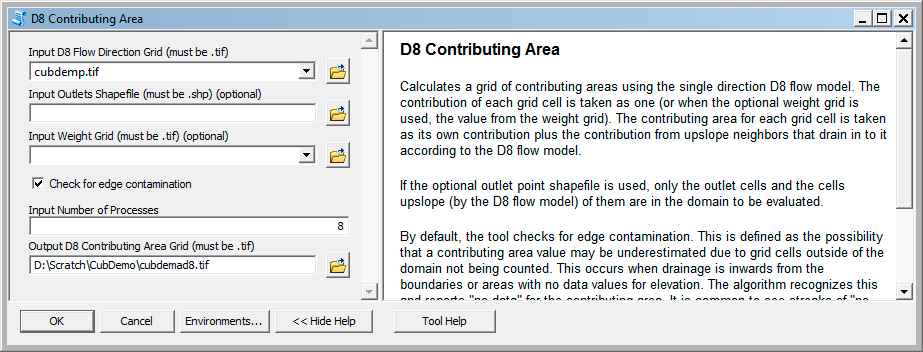
 此操作有两个可选项：（1）指定流域出口（outlet，shapefile文件）；（2）权重格网。在“show-help”中有详细的说明。指定流域出口会将水流累积格网的计算限制到指定出口的上游区域。还有一个选项是检查边界污染（edge contamination），即当水流方向由地形边界向内（inward）时计算集水区出现的问题。当DEM是根据流域边界剪切的，此项检查应该取消。 
 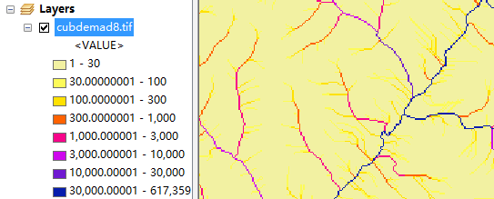

#### 1.5 网格网络（Grid Network）
 Grid Network操作以流向数据（`*p.tif`）为输入生成三种类型格网数据：（1）每个格网单元的最长流线（flow path）（`*plen.tif`）（2）每个格网单元作为结束点的所有流线的总长度（`*tlen.tif`）（3）格网网络序列（`*gord.tif`）。 
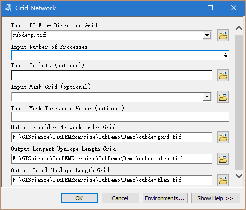 
格网网络序列(Grid Network Order)结果图： 
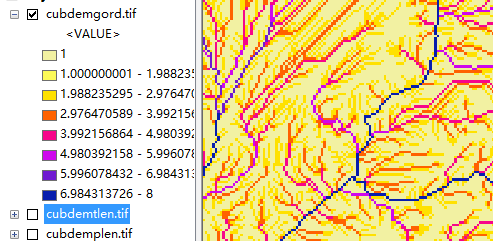

>基于D-Infinity算法的流向与集水区计算与前述基于D8算法的操作基本一致，请参照教程。

## 2. 河流网络分析 Stream Network Analysis
#### 2.1 基于阈值确定河道（Stream Definition by Threshold）
##### 2.1.1 基于输入的阈值确定河流栅格格网。
打开【Stream Definition By Threshold】，首先以水流累积格网`*ad8.tif`为输入数据，取**100**为阈值（阈值通常为100-200个格网单元），输出`*src.tif`数据 
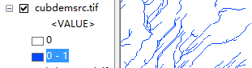

##### 2.1.2 移动出口点到河道上（Move Outlets to Streams）
勾绘流域出口（如水量站）上游的边界是一种常见的需求。由于站点与基于DEM勾绘出的河流之间的位置误差，站点往往不会精确地位于河流上，这时候就需要沿着D8流向往下坡方向移动直到站点遇到河道。
- 加入站点数据`CubGauge.shp`
- 打开Move Outlets to Streams根据面板
- 选择流向数据（`*p.tif`）和上一步生成的流域河道数据(`*src.tif`)
- 生成结果数据`*_Outletmv.shp`,加入到ArcMap中 
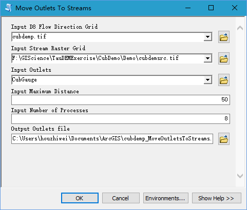 
图中红色三角形为结果，绿色圆形为原数据,蓝色为河道： 
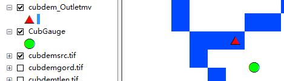

 >若遇到“该文件没有与之关联的程序来执行该操作”的错误，找到"C:\Program Files\TauDEM\TauDEM5Arc\MoveOutletsToStreams.py"，右键【打开方式】,找到并选择【python.exe】

##### 2.1.3 D8 Contributing Area
再次打开【D8 Contributing Area】工具，在【Outlets Shapefile】中选择刚刚得到的结果数据，执行得到只包括该站点上游流域的结果`cubdemssa.tif` 
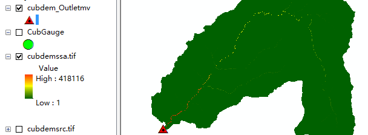
##### 2.1.4 Stream Definition By Threshold
再次打开【Stream Definition By Threshold】，以上一步生成的`cubdemssa.tif`为输入数据执行操作，生成`*src2.tif`. 
 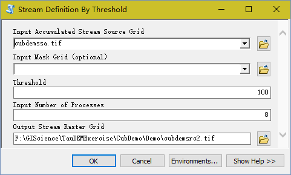 
 结果数据（`*src`为整个区域，`*src2`为水量站为出口定义的流域）：
 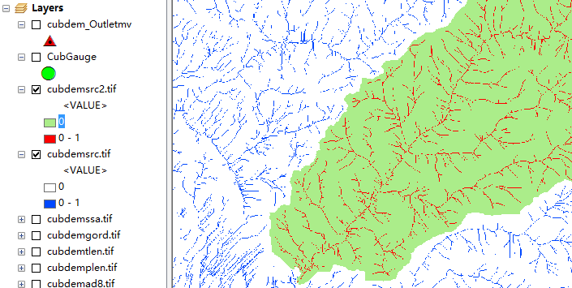

#### 2.2 河区及流域 （Stream Reach and Watershed）
打开【Stream Reach and Watershed】，输入填洼后的DEM（`*fel.tif`）、D8流向格网数据（`*p.tif`）、D8集水面积数据（`*ad8.tif`）、河道栅格数据（`*src2.tif`）、移动后的出口点数据（`*_Outletmv.shp`/`*_moved.shp`），输出一个河网shapefile数据`*net.shp`及与之相关的子流域数据`*w.tif`、河流序列格网`*ord.tif`及网络连接树数据（`*tree.txt`）和网络坐标(`*coord.txt`数据) 
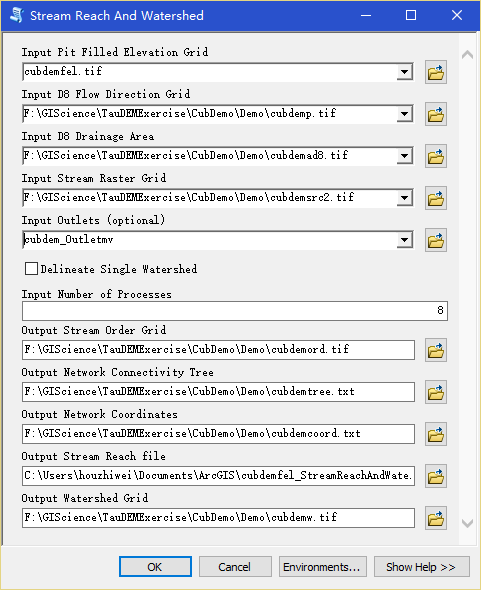 
结果图： 
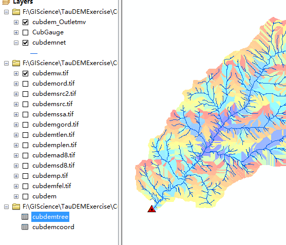
